# OPORD

[](https://github.com/flippelt/opord/actions) [](./LICENSE)

Monta o briefing da operação do clã com cara de documento controlado: capa, ordem, comunicado, intel, alvo, pedido de evacuação e o que mais a noite pedir. Você preenche, coloca o logo e as fotos, e leva um PDF ou uma imagem para o Discord, a sala ou a TV.

É para clãs de Arma 3, Squad, Hell Let Loose e jogos do mesmo tipo. Abre no navegador, na sua máquina. O que você escrever fica aí.

**Para ver sem instalar:** https://flippelt.github.io/opord/

[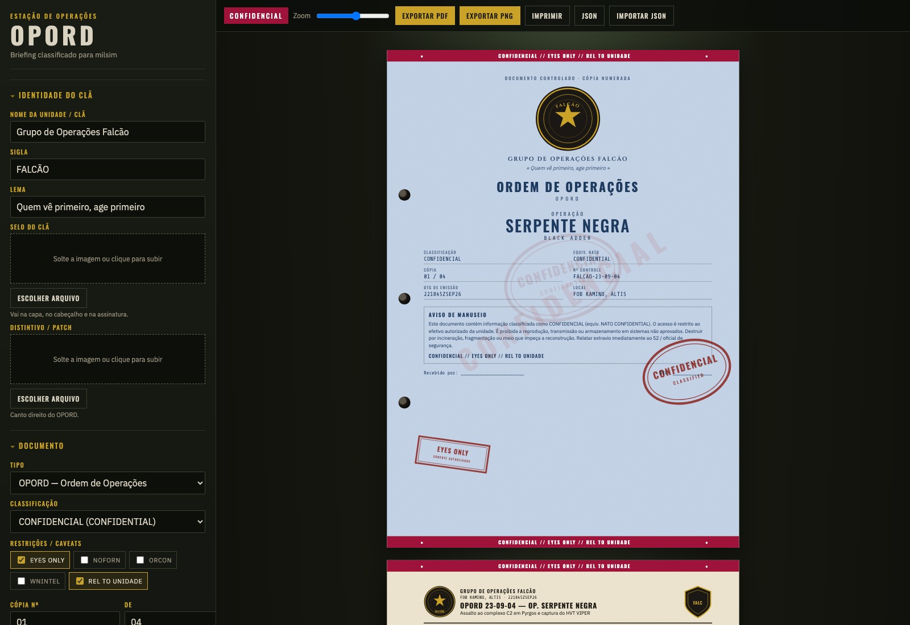](docs/screenshots/overview.jpg)

## O que entra no pacote

Liga e desliga cada folha em **Páginas**. O título de cada uma pode ser outro — “FRAGO 04” no lugar de OPORD, por exemplo. Dá para inserir uma página em branco, lisa ou pautada, e mudar a ordem do pacote.

| Folha | Para quê |
| --- | --- |
| Capa | Classificação, logo do clã, aviso de manuseio |
| Comunicado, convocação ou boletim | Aviso ao efetivo, com servidor, mods, slotting e ponto de reunião quando for noite de operação |
| OPORD | Situação, missão, execução, logística, comando |
| SITREP | Como está o inimigo, os amigos, o próprio efetivo e o que falta |
| AAR | O que rolou, o que deu certo, o que falhou, lições e BDA |
| ORBAT | Quem vai, com que indicativo e com que tarefa |
| HVT | Cartão do alvo, com retrato e se é para capturar ou abater |
| CASEVAC | As 9 linhas do pedido de evacuação |
| Intel | Fotos do briefing, com grid e fonte |

### Capa

[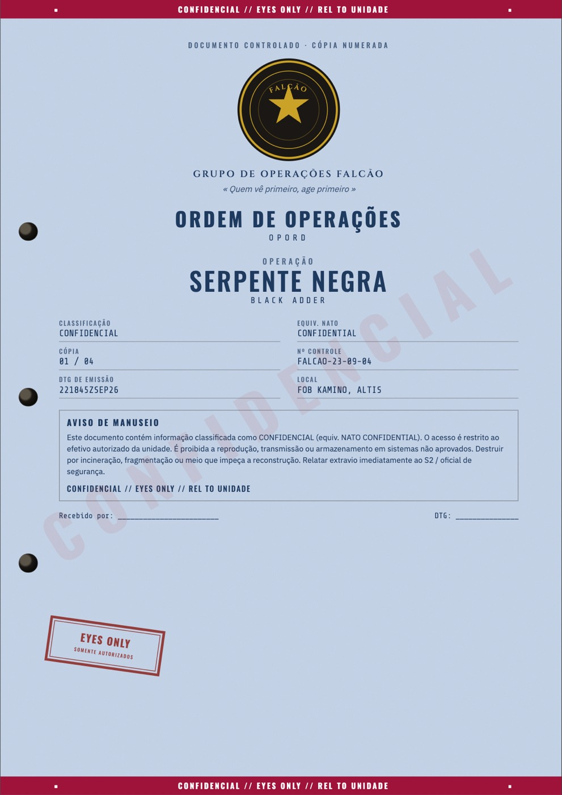](docs/screenshots/capa.jpg)

### Comunicado

[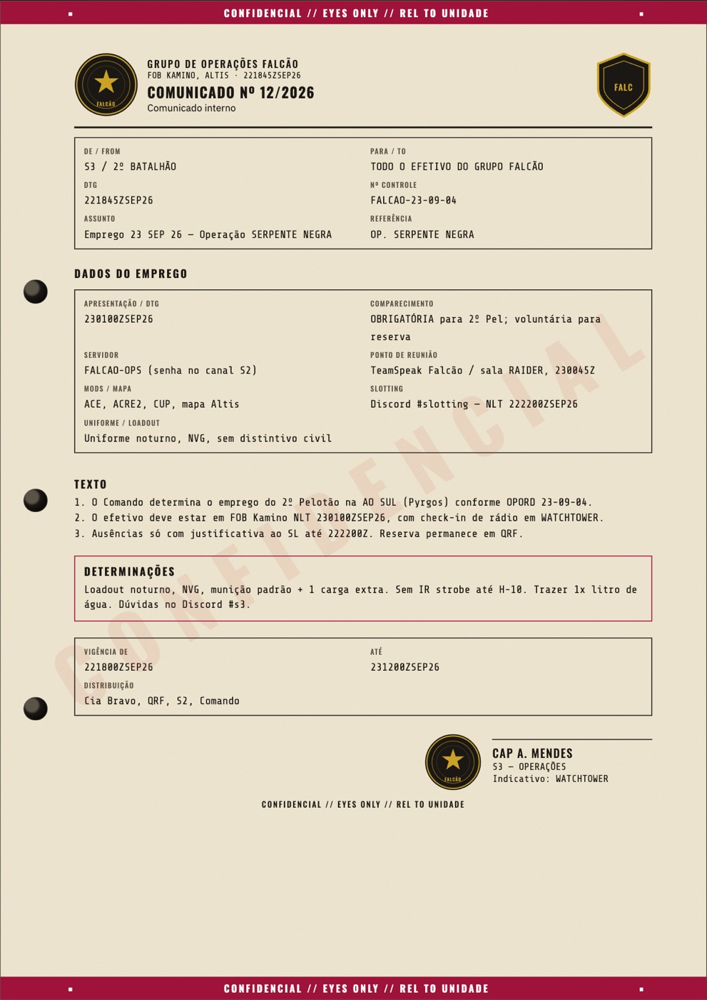](docs/screenshots/notice.jpg)

### Ordem

[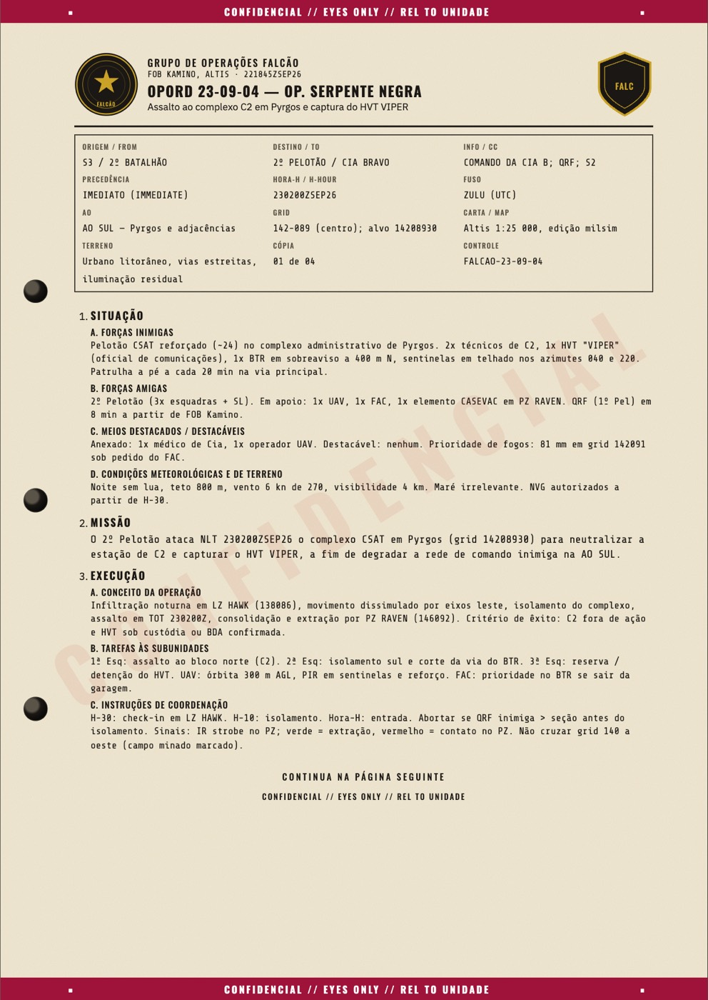](docs/screenshots/opord-1.jpg)
[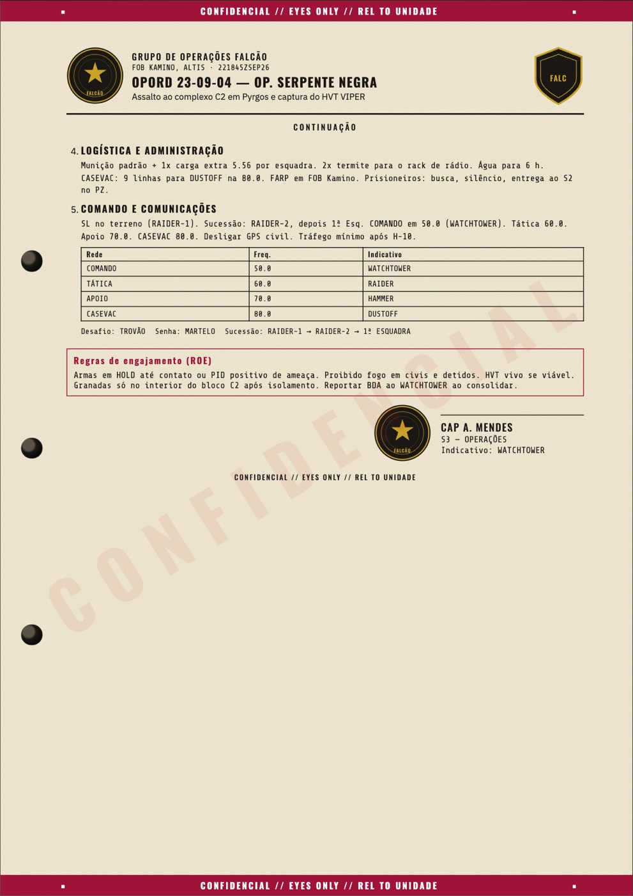](docs/screenshots/opord-2.jpg)

### Situação, revisão e efetivo

[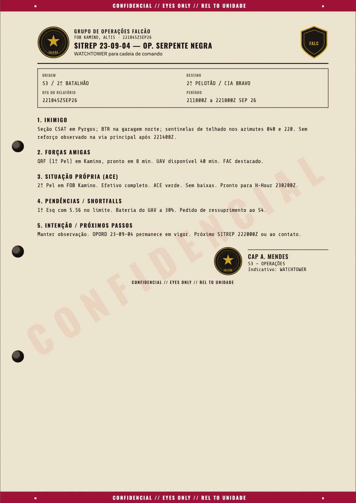](docs/screenshots/sitrep.jpg)
[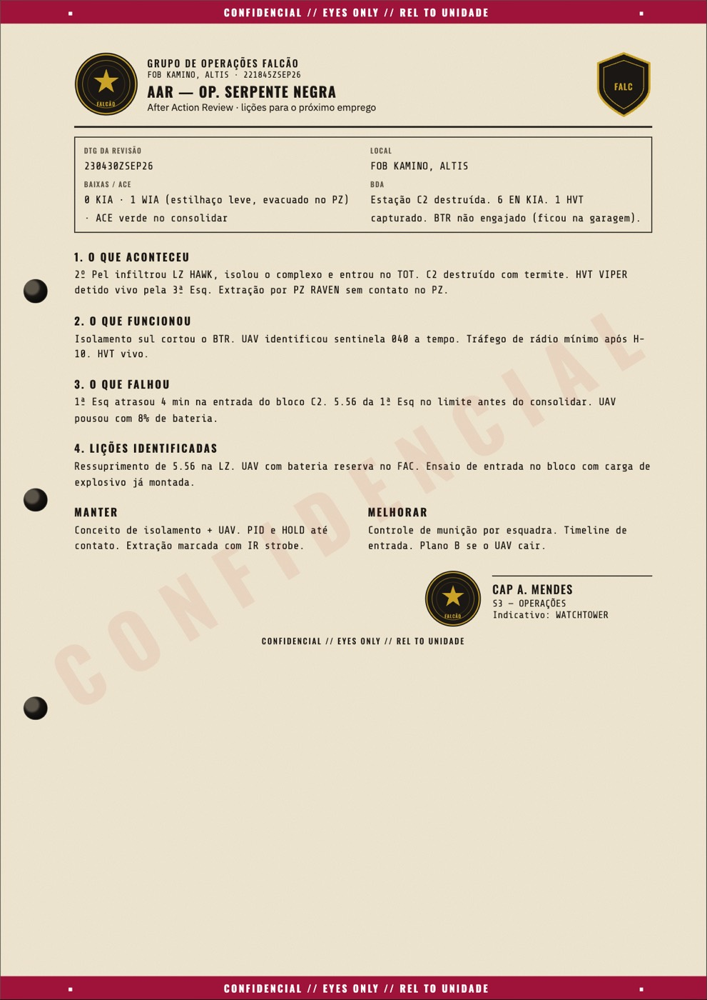](docs/screenshots/aar.jpg)
[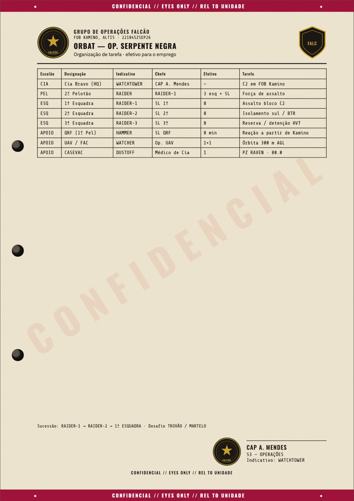](docs/screenshots/orbat.jpg)

### Alvo e evacuação

[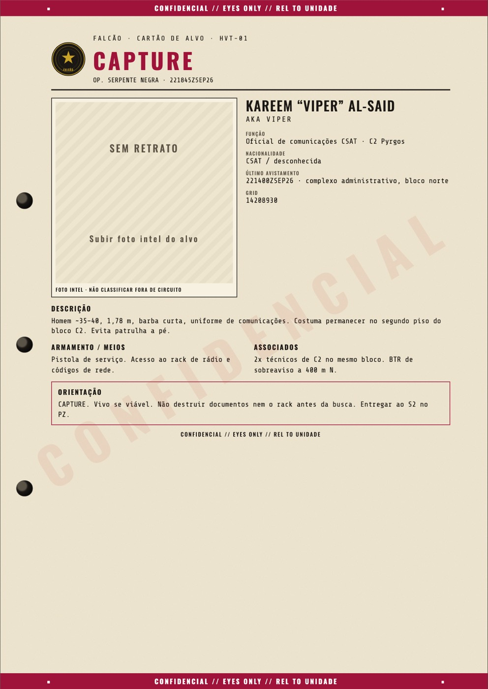](docs/screenshots/hvt-1.jpg)
[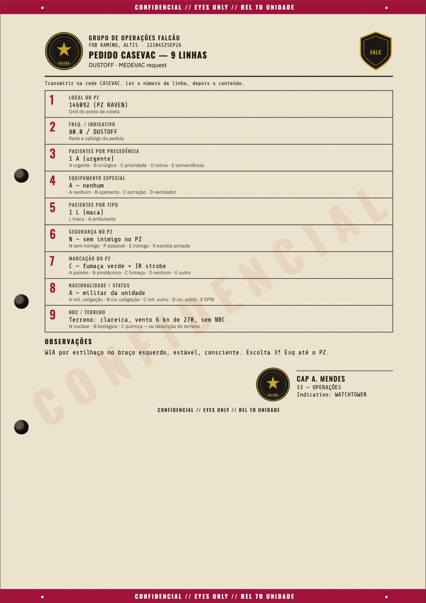](docs/screenshots/casevac.jpg)

### Fotos

[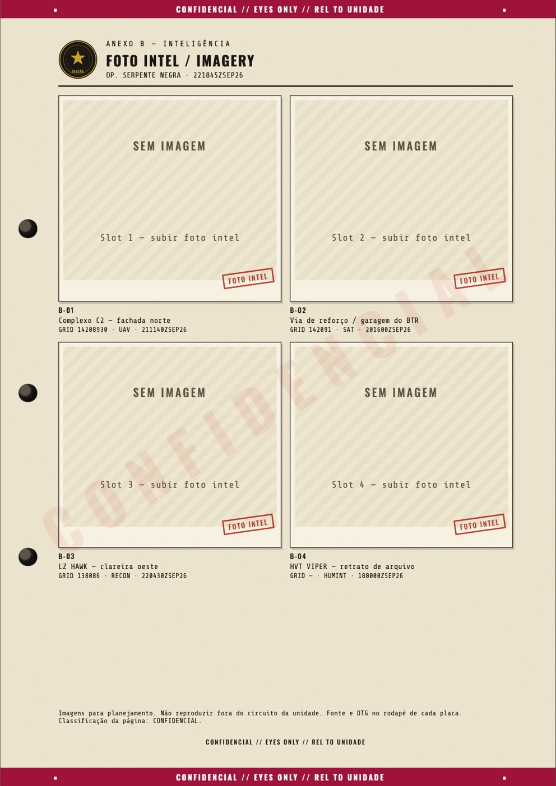](docs/screenshots/intel.jpg)

## Classificação

A capa muda de cor conforme o nível. A marca d'água grande na diagonal usa o mesmo nome, ou o texto que você escrever no lugar.

| No papel | Equivalente NATO |
| --- | --- |
| OSTENSIVO | UNCLASSIFIED |
| RESERVADO | RESTRICTED |
| CONFIDENCIAL | CONFIDENTIAL |
| SECRETO | SECRET |
| ULTRA-SECRETO | TOP SECRET |

Dá para acrescentar restrições como EYES ONLY, NOFORN e ORCON no cabeçalho e no rodapé. O logo do clã vai na capa, no cabeçalho e na assinatura. O mesmo logo, ou outra imagem, pode virar a marca d'água, bem clara, com o texto confidencial por cima na cor que combinar. O patch fica no canto da ordem.

## Como abrir

Se você não mexe em terminal, instale o [Node.js 22](https://nodejs.org/) uma vez (o instalador do site) e dê dois cliques:

| Onde | Arquivo |
| --- | --- |
| Mac | `Abrir-OPORD.command` |
| Windows | `Abrir-OPORD.bat` |
| Linux | `abrir-opord.sh` |

No Mac, se o sistema recusar na primeira vez, clique com o botão direito e escolha Abrir. A janela que aparecer instala o que falta, abre o navegador e precisa ficar aberta enquanto você usa. Fechar ela encerra o programa.

Quem prefere terminal:

```bash
npm install
npm run abrir
```

A primeira vez mostra a operação de exemplo **Serpente Negra**, em Altis. Dá para editar por cima ou começar um **dossiê em branco**. O trabalho fica salvo neste navegador. PDF, imagens e um arquivo JSON servem para levar a operação para outro computador do clã.

## Licença

MIT © 2026 Felipe Lippelt
